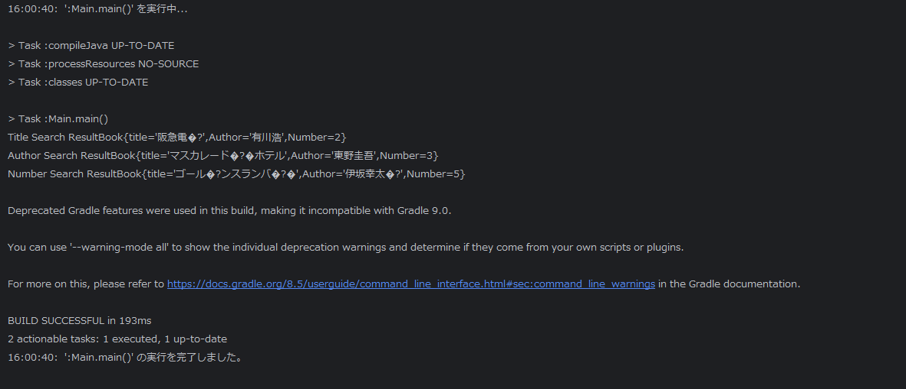

# Book

## 課題

- 図書管理システムを作る
- 書籍（book）を管理する情報（タイトル、著者、番号）を持つオブジェクト（クラス）を作って、そこに情報を格納してください。
- 図書館（Library）みたいなものを作って、そこにBookをListで持つようなものを保持する。
- mainメソッドからこのLibraryクラスに対して検索ができるようにする。Libraryクラスは書籍検索の機能を持つ。
- タイトル検索、著者検索、番号検索メソッドをLibraryに持たせる。
- それをmainメソッドから実行して、実行結果をコンソールに出力する。

### Bookクラス

#### フィールド

タイトル：title  
著者：author  
番号：number

#### コンストラクタ

フィールドの初期化

#### getter

各フィールドの値を取得するためのgetterメソッドを生成

#### ToStringメソッド

String.formatを使用しフィールドをフォーマットされた文字列を作成

### Libraryクラス

- bookListを作成
- bookListをArrayList<>で初期化
- addBookメソッドでbookListに書籍を追加する
- 各書籍の検索を行う機能をもつ   
  searchByTitleメソッド:title前方部分が一致すればbook情報を返す  
  searchByAuthorメソッド:authorが完全一致でbookを返す  
  searchByNumberメソッド:numberが完全一致でbookを返す

### Mainクラス

libraryに書籍を追加する  
書籍を各検索機能を使用して検索を行う。一致すれば実行結果をコンソールに出力する。一致しなければnull値を返す。

## 結果

